# Báo cáo Lab Day 1 — <Họ tên> — 2A202602451

## 1. Thiết lập

- **Môi trường:** Google Colab (mở từ VS Code), GPU Tesla T4 (compute capability 7.5), PyTorch 2.11.0+cu130. Mọi số trong báo cáo lấy từ cùng một lần *Restart & Run All*; mọi lần chạy đặt seed cố định.
- **Dữ liệu:** Forest CoverType; `train` 464 809 / `eval` 116 203 theo `split_metadata.csv`. Validation là 20% của train (phân tầng, seed 42), còn 371 847 train / 92 962 val. Chuẩn hoá 10 cột số bằng mean/std **chỉ của phần train**, 44 cột nhị phân giữ nguyên.
- **Model:** `M-base` (54→256→128→7, 47 879 tham số, có `assert`). **Baseline:** CE, SGD + momentum 0,9, lr = 0,3 (chọn bằng val, mục 2), batch 512, 20 epoch, khởi tạo He (`kaiming_normal_`, bias 0), không dropout/clip, FP32.
- **Mốc tham chiếu:** accuracy "luôn đoán lớp đa số" trên val = 0,4876 (macro-F1 ≈ 0,094).
- **Các chủ đề đã thử:** ☑ loss ☑ optimizer ☑ hyper-parameter ☑ dropout ☑ clipping ☑ mixed precision ☑ init. Tổng cộng 41 lần chạy, mỗi lần là một dòng trong `experiments.xlsx` và có một ảnh `figures/<exp_id>.png`.

## 2. Kiểm tra ban đầu và độ nhiễu

| Kiểm tra | Kết quả |
|---|---|
| Số tham số / shape logits | 47 879 / (B, 7); M-wide 161 287, M-deep 55 687 cũng khớp |
| Loss bước 0 (so với ln 7 = 1,946) | 2,378 (model ở Part 1); 2,269 với seed 1 của các lần chạy. Cao hơn ln 7 vì He cho logit std ≈ 0,65 và lệch chung theo lớp; thu logit ×0,01 thì loss = 1,948 |
| Quá khớp 20 mẫu: loss cuối | 1,3e-6 sau 500 bước (100% accuracy từ bước 5) |
| Mọi tham số có gradient khác 0 | ☑ có (‖grad‖ của W1…b3 từ 0,38 đến 2,34) |
| Baseline, số seed đã chạy | 3 (`base-s1`, `base-s2`, `base-s3`) |
| Baseline: val acc (TB ± σ) | 0,9118 ± 0,0027 |
| Baseline: val macro-F1 (TB ± σ) | 0,8607 ± 0,0030 |

**Ngưỡng nhiễu dùng trong báo cáo:** 2σ = **0,0060** (val macro-F1). Mỗi thí nghiệm ở mục 3 chỉ chạy 1 seed (seed 1), nên Δ của từng thí nghiệm cũng có nhiễu cỡ σ; các Δ chỉ nhỉnh hơn 2σ được ghi là "chưa chắc".

**Chọn lr baseline** (`hp-lr*`, 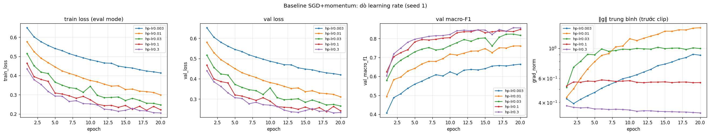): val macro-F1 tăng đều theo lr: 0,003 → 0,6647; 0,01 → 0,7613; 0,03 → 0,8170; 0,1 → 0,8390; 0,3 → 0,8573. Không lr nào phân kỳ. lr nhỏ học chậm: với 0,003 val loss vẫn 0,42 và còn giảm ở epoch 20. lr 0,3 nằm ở biên lưới; kết quả 0,1 và 0,3 chỉ là 1 seed. Đường cong baseline (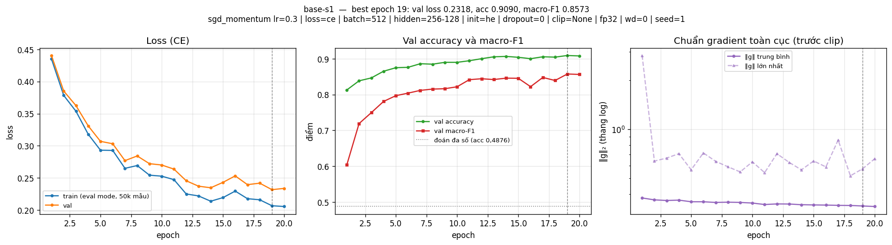) giảm nhanh rồi dao động nhẹ ở cuối (best epoch 16–19 tuỳ seed); val − train loss ≈ 0,03, nên **chưa khớp hết, chưa quá khớp**.

## 3. Kết quả theo chủ đề

Tất cả so sánh dựa trên **val**; Δ = val macro-F1 − trung bình baseline (0,8607).

### 3.1 Hàm mất mát — CE vs MSE (`loss-mse-lr0.3`, `loss-mse-lr1`; 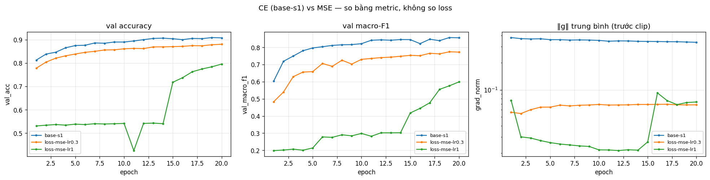)
- **Dự đoán:** MSE (logit vs one-hot, `nn.MSELoss` mặc định: không có 1/2, trung bình trên B·7 phần tử) kém rõ, nhất là ở lớp hiếm; lr lớn hơn sẽ bù được gradient nhỏ.
- **Kết quả:** MSE lr 0,3 đạt 0,7726 (**Δ = −0,088**, ≈ 15 lần 2σ). Accuracy chỉ giảm 0,029 nhưng macro-F1 giảm 0,085, tức thiệt hại dồn vào lớp hiếm. MSE lr 1,0 còn tệ hơn (0,5991, gai ‖g‖ = 14,2), trái với dự đoán.
- **Cơ chế:** gradient theo logit của MSE là 2(z − y)/(B·7), nhỏ hơn CE (p − y)/B; ‖g‖ trung bình đo được 0,066 so với 0,352. MSE coi 7 logit như 7 bài hồi quy độc lập, nên với lớp hiếm cách rẻ nhất là kéo logit về 0 ở mọi mẫu. CE thì luôn đẩy lớp đúng lên cho tới khi nó thắng. Không so trực tiếp giá trị loss (0,027 so với 0,232) vì khác thang đo. *Hạn chế:* chưa thử lr < 0,3 cho MSE.

### 3.2 Bộ tối ưu hoá (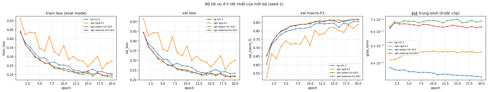)
- **Dự đoán:** Adam/AdamW tăng nhanh hơn ở các epoch đầu; ở lr tốt nhất mỗi bộ, chênh lệch sau 20 epoch nhỏ; SGD thuần kém SGD + momentum; Adam ≈ AdamW.

| bộ tối ưu (betas = 0,9/0,999, eps = 1e-8) | lr đã thử | lr tốt nhất (`exp_id`) | val macro-F1 | best epoch |
|---|---|---|---|---|
| SGD + momentum 0,9 | 0,003; 0,01; 0,03; 0,1; 0,3 | 0,3 (`hp-lr0.3`) | 0,8573 | 19 |
| SGD (μ = 0) | 0,3; 1; 3 | 1 (`opt-sgd-lr1`) | 0,8344 | 18 |
| Adam (wd 0) | 3e-4; 1e-3; 3e-3 | 3e-3 (`opt-adam-lr0.003`) | 0,8677 | 19 |
| AdamW (wd 0,01) | 1e-3; 3e-3 | 3e-3 (`opt-adamw-lr0.003`) | 0,8646 | 18 |

- **Kết quả:** Adam Δ = +0,007, chỉ vừa vượt 2σ với 1 seed, nên là **"có thể tốt hơn chút ít, chưa chắc"**. AdamW Δ = +0,004 nằm trong nhiễu, và Adam ≈ AdamW (chênh 0,003). SGD thuần kém rõ (Δ = −0,026). **Độ nhạy với lr** lớn hơn mọi khác biệt giữa các bộ: Adam 3e-4 → 3e-3 thay đổi 0,08; SGDM 0,01 → 0,3 thay đổi 0,10.
- **Cơ chế:** momentum cộng dồn gradient của ~1/(1−μ) = 10 bước nên đi nhanh hơn theo hướng ổn định. Khác dự đoán: SGD lr 3 (bước hiệu dụng bằng SGDM lr 0,3) chỉ đạt 0,6155, có gai ‖g‖ = 31. Với SGD thuần, một gai được nhân nguyên lr = 3 trong *một* bước; momentum rải cùng gai đó ra ~10 bước (giả thuyết). Adam tốn thêm ~15% thời gian mỗi epoch (cập nhật m, v). *Hạn chế:* lr tốt nhất của SGDM, Adam, AdamW đều nằm ở **biên lưới**.

### 3.3 Hyper-parameter (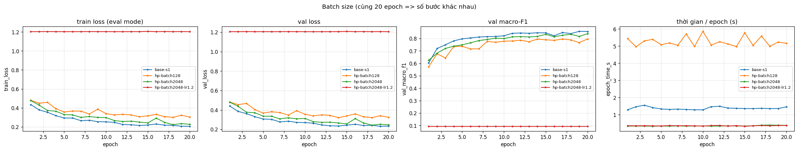 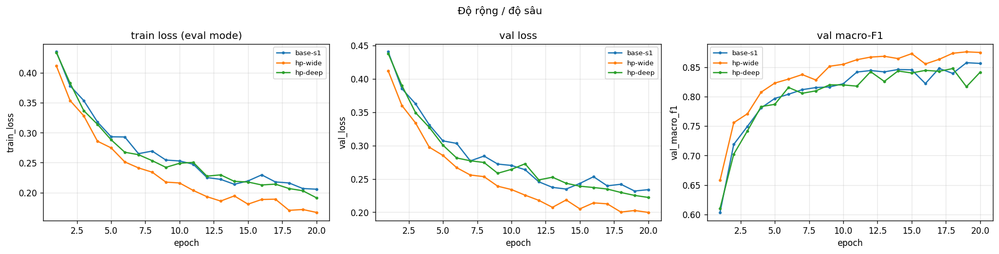 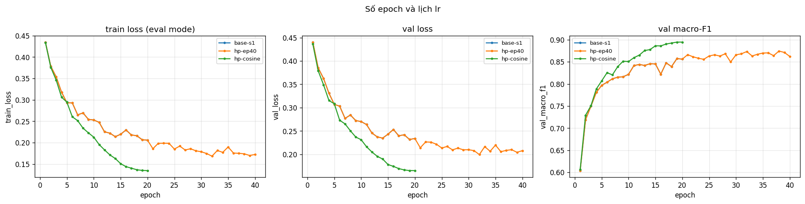)

| exp_id | thay đổi | số bước | s/epoch | val macro-F1 | Δ |
|---|---|---|---|---|---|
| `hp-batch128` | batch 128, cùng lr | 58 120 | 5,26 | 0,7951 | −0,066 |
| `hp-batch2048` | batch 2048, cùng lr | 3 640 | 0,35 | 0,8338 | −0,027 |
| `hp-batch2048-lr1.2` | batch 2048, lr ×4 (2 yếu tố) | 3 640 | 0,36 | 0,0936 | sụp |
| `hp-wide` | M-wide 512-256 | 14 540 | 1,43 | 0,8747 | **+0,014** |
| `hp-deep` | M-deep 256-128-64 | 14 540 | 1,51 | 0,8413 | −0,019 |
| `hp-ep40` | 40 epoch | 29 080 | 1,36 | 0,8733 | **+0,013** |
| `hp-cosine` | lr cosine 0,3 → 0 | 14 540 | 1,37 | 0,8947 | **+0,034** |

- **Batch:** cùng 20 epoch nhưng số bước khác nhau. Batch 2048 kém vì chỉ còn 1/4 số bước, đúng dự đoán; bù lại mỗi epoch nhanh hơn 3,9 lần. Khác dự đoán: batch 128 *kém* (−0,066) dù gấp 4 lần số bước. Độ nhiễu của SGD tỉ lệ lr/B, giữ lr = 0,3 mà giảm B 4 lần thì nhiễu tăng ~4 lần (theo quy tắc tỉ lệ, lr phù hợp là ≈ 0,075, chưa chạy). Quy tắc lô ×4 → lr ×4 **không có warm-up** làm mạng sụp về luôn đoán lớp đa số: gai ‖g‖ = 14,8 rồi ‖g‖ chỉ còn 0,037 (ReLU chết), dù loss không NaN.
- **Kiến trúc:** M-wide tốt hơn (+0,014), khớp dự đoán "baseline đang chưa khớp, thêm năng lực thì giúp". Thời gian chỉ tăng ~4% vì GPU chưa bão hoà. Khác dự đoán: M-deep có val loss thấp hơn `base-s1` nhưng macro-F1 thấp hơn; 1 seed không đủ để kết luận độ sâu làm hại.
- **Lịch lr:** cosine là **cải thiện lớn nhất** (+0,034, gấp ~6 lần 2σ) mà không thêm bước nào, lớn hơn cả việc gấp đôi số epoch. Với lr cố định, SGD dừng ở một mức nhiễu sàn tỉ lệ với lr (val loss dao động cuối huấn luyện); giảm lr về 0 cho phép đi xuống đáy vùng đó.

### 3.4 Dropout (`drop-0.1`, `drop-0.3`; 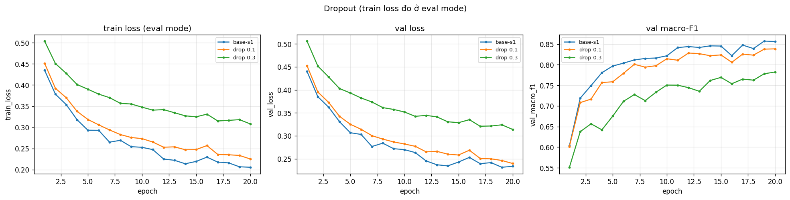)
- **Dự đoán:** baseline chưa quá khớp nên dropout không giúp.
- **Kết quả:** q = 0,1 cho 0,8385 (Δ = −0,022), q = 0,3 cho 0,7824 (Δ = −0,078); cả hai vượt 2σ. Khoảng cách val − train giảm 0,028 → 0,015 → 0,006, nhưng do **train loss (đo ở eval mode) tăng** 0,206 → 0,225 → 0,308 chứ không phải val loss giảm.
- **Trả lời:** mô hình **không** quá khớp (khoảng cách nhỏ, val loss còn giảm), nên dropout chỉ cản việc khớp dữ liệu.

### 3.5 Gradient clipping (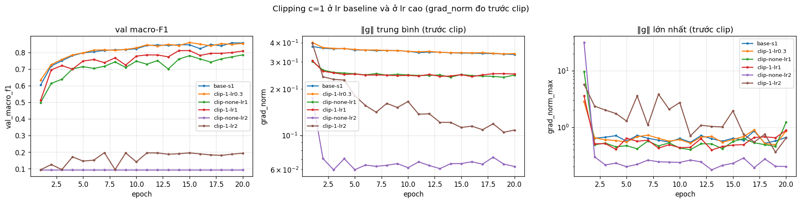)
- **Chọn c:** ‖g‖ trung bình của baseline 0,33–0,38, gai tới 4,1, nên chọn c = 1,0 để chỉ cắt gai.
- **Ở lr bình thường** (`clip-1-lr0.3`): clip kích hoạt ở 1,9% số bước của epoch 1 và 0% ở các epoch sau. macro-F1 0,8534 so với 0,8573 của `base-s1` (cùng seed, chênh < 2σ, val loss còn thấp hơn): **không có khác biệt**.
- **Ở lr cao:** lr = 1 không clip đạt 0,7732 (gai ‖g‖ = 9,7); có clip đạt 0,8106 (+0,037). lr = 2 không clip: gai ‖g‖ = 31,5 ở epoch 1, sau đó ‖g‖ ≈ 0,2 và mạng chỉ đoán lớp đa số (0,0936). lr = 2 có clip thì mạng sống nhưng chỉ đạt 0,1462, vì bước vẫn bị chặn ở lr·c = 2, quá lớn.
- **Kết luận:** clipping chặn tác hại của các bước gai, nhưng không thay được việc chọn lr đúng.

### 3.6 Mixed precision (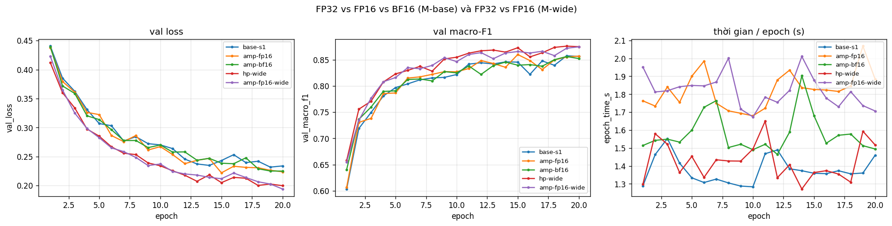)

| exp_id | precision | s/epoch | peak MB | val macro-F1 |
|---|---|---|---|---|
| `base-s1` | FP32 | 1,38 | 208,7 | 0,8573 |
| `amp-fp16` | FP16 + GradScaler | 1,82 | 208,7 | 0,8597 |
| `amp-bf16` | BF16 | 1,58 | 208,7 | 0,8520 |
| `hp-wide` / `amp-fp16-wide` | FP32 / FP16, M-wide | 1,43 / 1,82 | 225,6 / 225,6 | 0,8747 / 0,8745 |

- **Độ chính xác:** FP16 ≈ FP32. BF16 thấp hơn 0,005 so với `base-s1` cùng seed (< 2σ), chưa kết luận được. GradScaler bỏ qua 4 bước đầu (hệ số s khởi đầu quá lớn làm gradient tràn FP16, sau đó s tự giảm).
- **Tốc độ:** **không nhanh hơn mà chậm hơn**: FP16 +32%, BF16 +15% (T4 không có BF16 phần cứng, PyTorch giả lập). Phép nhân lớn nhất chỉ (512 × 54)·(54 × 256), nên thời gian do chi phí gọi kernel quyết định; autocast thêm kernel ép kiểu, GradScaler thêm bước nhân/chia và kiểm tra inf. M-wide vẫn chưa đủ lớn để thấy lợi ích. Bộ nhớ đỉnh không đổi vì phần lớn là dữ liệu nằm sẵn trên GPU (kích hoạt một lô chỉ ~0,5 MB).
- **FP16 và BF16:** FP16 có 5 bit mũ (số dương nhỏ nhất ≈ 6e-8), nên gradient nhỏ dễ underflow và cần nhân loss với s. BF16 có 8 bit mũ như FP32, không underflow nên không cần s, chỉ kém về độ chính xác (7 bit định trị).

### 3.7 Khởi tạo tham số (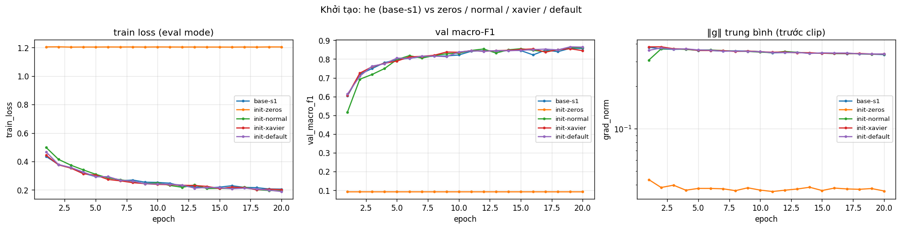)
- **Bước 0** (std kích hoạt đo sau mỗi ReLU, lô val 4 096):

| init | std ReLU1 / ReLU2 / logit | loss bước 0 | macro-F1 sau 20 epoch (`init-*`) |
|---|---|---|---|
| he (baseline) | 0,39 / 0,37 / 0,58 | 2,267 | 0,8573 (`base-s1`) |
| xavier (`xavier_normal_`, Var = 2/(n_vào+n_ra)) | 0,16 / 0,12 / 0,19 | 2,021 | 0,8502 |
| default (`nn.Linear`) | 0,16 / 0,07 / 0,06 | 1,984 | 0,8637 |
| normal N(0; 0,01²) | 0,020 / 0,0021 / 0,0003 | 1,946 | 0,8609 |
| zeros | 0 / 0 / 0 | 1,9459 = ln 7 | **0,0936** |

- **`zeros` đúng như dự đoán:** gradient của W1, W2, W3, b1 ở bước 0 **bằng đúng 0**, chỉ b3 có gradient. Mọi nơ-ron cùng lớp đối xứng tuyệt đối và đầu ra ReLU(0) = 0, nên đối xứng không bao giờ bị phá; mạng chỉ học được tần suất lớp và luôn đoán lớp đa số (val loss 1,205).
- **Các cách khác:** sau 20 epoch đều trong khoảng nhiễu của He (xavier −0,011 so với trung bình, nhưng chỉ −0,007 so với `base-s1` và val loss thấp hơn: chưa kết luận được). Mạng 3 lớp **chưa đủ sâu** để thấy khác biệt. Với mạng 30 lớp (chỉ forward), He giữ std 0,40 → 0,25 ở lớp 30; xavier giảm còn 4,6e-6; normal về 0 tuyệt đối, đúng như biểu đồ "30 lớp ReLU" của slide.

## 4. Đánh giá cuối trên tập eval

**Cấu hình cuối** (chọn chỉ bằng val, mục 3.8 của notebook): kết hợp ba thay đổi vượt 2σ là M-wide + cosine + 40 epoch, giữ nguyên phần còn lại của baseline. Trong 3 ứng viên (`fin-cos-ep40` 0,9088, `fin-wide-cos` 0,9092, `fin-wide-cos-ep40` 0,9232), chọn ứng viên có val macro-F1 cao nhất. Ba seed của cấu hình này cho val macro-F1 **0,9204 ± 0,0030**, so với baseline 0,8607 ± 0,0030; seed tệ nhất (0,9173) vẫn hơn seed tốt nhất của baseline (0,8630). Adam (+0,007) không được đưa vào vì chỉ vừa chạm 2σ. Mô hình nộp: **seed 1** (cố định trước), trọng số ở best epoch 40.

| Cấu hình | exp_id | Seed nộp | val macro-F1 | **eval macro-F1** | eval accuracy |
|---|---|---|---|---|---|
| Baseline | `base-s1` | 1 | 0,8573 | **0,8565** | 0,9089 |
| Cấu hình cuối cùng | `fin-wide-cos-ep40` | 1 | 0,9232 | **0,9264** | 0,9551 |

(Số eval lấy từ `eval_result_baseline.json` và `eval_result.json` do `scripts/evaluate.py` ghi; `predictions_eval.csv` là của cấu hình cuối.)

- **Cải thiện trên eval:** +0,070 macro-F1, khoảng 23 lần σ_seed đo trên val. Trên eval mỗi cấu hình chỉ có 1 seed nên chưa có σ riêng của eval, nhưng mức chênh trên val (3 seed) là +0,060 với hai phân phối không chồng nhau.
- **Val so với eval:** lệch −0,0009 (baseline) và +0,0032 (cuối), nhỏ hơn σ_seed. Val là ước lượng đáng tin của eval, khớp với ghi chú trong GUIDE.

### 4.1 Phân tích lỗi theo lớp (`eval_result.json`; 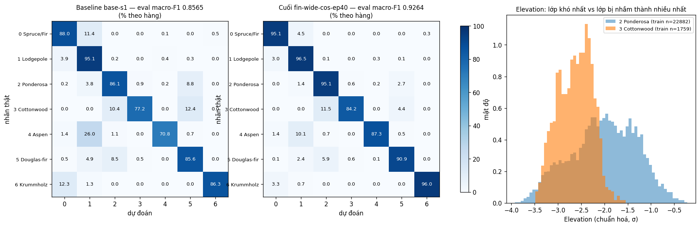)

| Lớp | support | precision | recall | F1 | F1 baseline |
|---|---|---|---|---|---|
| 0 Spruce/Fir | 42 368 | 0,9560 | 0,9515 | 0,9537 | 0,9044 |
| 1 Lodgepole Pine | 56 661 | 0,9597 | 0,9646 | 0,9622 | 0,9263 |
| 2 Ponderosa Pine | 7 151 | 0,9509 | 0,9515 | 0,9512 | 0,8943 |
| 3 Cottonwood/Willow | 549 | 0,8851 | 0,8415 | **0,8627** | 0,8015 |
| 4 Aspen | 1 899 | 0,8900 | 0,8731 | 0,8814 | 0,7595 |
| 5 Douglas-fir | 3 473 | 0,9146 | 0,9093 | 0,9119 | 0,8089 |
| 6 Krummholz | 4 102 | 0,9628 | 0,9603 | 0,9616 | 0,9002 |

- **Ma trận cho thấy (đo được):** lớp khó nhất là **lớp 3 Cottonwood/Willow (F1 = 0,8627)**. Trong 549 mẫu thật, 63 mẫu (11,5%) bị đoán thành **lớp 2 Ponderosa Pine** và 24 mẫu thành lớp 5 Douglas-fir. Chiều ngược lại, 60 mẫu lớp khác bị đoán thành lớp 3, trong đó 40 mẫu từ Ponderosa. Về số lượng tuyệt đối, cặp nhầm nhiều nhất là 0 ↔ 1 (Spruce/Fir và Lodgepole: 1 896 + 1 689 mẫu), nhưng hai lớp này rất lớn nên F1 vẫn > 0,95. Ở baseline, lớp khó nhất là 4 Aspen (0,7595); cấu hình cuối cải thiện Aspen và Douglas-fir nhiều nhất (+0,12 và +0,10).
- **Dữ liệu cho thấy (đo trên train):** lớp 3 chỉ có 1 759 mẫu train (0,47%), ít hơn Ponderosa 13 lần (22 882). 100% mẫu Cottonwood nằm ở Wilderness_Area_3, và 60% mẫu Ponderosa cũng ở đó. Cả hai đều ở độ cao rất thấp (Elevation trung bình −2,63σ và −2,02σ); 39% mẫu Ponderosa rơi vào khoảng Elevation chứa 90% mẫu Cottonwood. Các đặc trưng phân biệt rõ hơn là Hillshade_9am (+1,0σ), Hillshade_3pm (−0,78σ) và khoảng cách tới nguồn nước (−0,50σ, Cottonwood gần nước hơn, hợp với việc đây là loài ven sông).
- **Giả thuyết (chưa kiểm chứng bằng thí nghiệm):** lớp 3 vừa hiếm vừa chồng lấn với Ponderosa ở hai đặc trưng mạnh nhất (Elevation, Wilderness_Area). CE không trọng số ưu tiên lớp lớn hơn trong vùng chồng lấn, nên ranh giới bị kéo về phía Ponderosa. **Cách sẽ thử:** CE có trọng số theo tần suất lớp (hoặc lấy mẫu lại lớp hiếm), chọn bằng val macro-F1. Mình chưa chạy thí nghiệm này, đây là hạn chế.

## 5. Trả lời các câu hỏi dẫn dắt

1. **Bộ tối ưu nào "thắng" khi chỉnh lr công bằng?** Ở lr tốt nhất của mỗi bộ, Adam (0,8677) ≈ AdamW (0,8646) ≈ SGD + momentum (0,8573); các chênh lệch sát ngưỡng 2σ = 0,006 với 1 seed, nên không có bộ nào thắng rõ, chỉ SGD thuần thua rõ (0,8344). Nếu không chỉnh lr, kết luận đảo theo lr: ví dụ so Adam 3e-3 với SGDM 0,01 thì "Adam thắng 0,106", còn Adam 3e-4 với SGDM 0,3 thì "SGDM thắng 0,07". Mức chênh do lr lớn hơn mức chênh do bộ tối ưu.
2. **Dropout có giúp khi chưa quá khớp?** Không: `drop-0.1` −0,022, `drop-0.3` −0,078, train loss tăng chứ val loss không giảm. Nên dùng khi val loss bắt đầu tăng trong khi train loss vẫn giảm (khoảng cách mở rộng), ví dụ mô hình lớn hơn chạy lâu hơn; `fin-wide-cos-ep40` đã có khoảng cách 0,05, là nơi đáng thử dropout tiếp.
3. **Gradient clipping giải quyết gì?** Chặn tác hại của các bước có ‖g‖ đột ngột lớn. Bằng chứng: ở lr = 1, gai ‖g‖ = 9,7 làm mạng kém đi (0,7732), clip c = 1 nâng lên 0,8106. Ở lr = 2, gai 31,5 làm ReLU chết hẳn (0,0936). Ở lr bình thường clip gần như không kích hoạt (1,9% bước của epoch 1) và không đổi kết quả.
4. **Mixed precision có nhanh hơn?** Không: trên T4, FP16 chậm hơn FP32 32%, BF16 chậm hơn 15%, kể cả với M-wide. Mạng quá nhỏ nên thời gian bị chi phối bởi chi phí gọi kernel, không phải phép nhân ma trận; AMP còn thêm kernel ép kiểu và bước GradScaler. Bộ nhớ không giảm vì phần lớn là dữ liệu.
5. **Vì sao khởi tạo toàn 0 hỏng? He khác Xavier ở đâu?** Toàn 0 làm mọi nơ-ron đối xứng và ReLU(0) = 0, nên gradient của mọi W bằng 0 và chỉ bias lớp cuối học (đo được ở `init-zeros`). He dùng Var = 2/n_vào để bù việc ReLU bỏ một nửa tín hiệu; Xavier dùng 2/(n_vào + n_ra) (≈ 1/n_vào), thiết kế cho hàm kích hoạt đối xứng, nên với ReLU tín hiệu giảm ~1/√2 mỗi lớp. Ở mạng 3 lớp khác biệt không đáng kể; ở mạng 30 lớp, Xavier làm std còn 4,6e-6 còn He giữ ≈ 0,25. Điều này quan trọng với mạng sâu.
6. **Loss không giảm sau 2 000 bước: 3 phép kiểm tra đầu tiên.**
   1. **Loss bước 0 và dữ liệu:** so với ln 7 = 1,946, và kiểm tra nhãn (0..6), chuẩn hoá (mean/std ≈ 0/1). Lệch lớn báo lỗi dữ liệu hoặc khởi tạo (của mình là 2,27 do He ở lớp cuối, đã giải thích được). Loss kẹt quanh 1,2 ≈ entropy của phân phối lớp nghĩa là mô hình chỉ học được tần suất lớp (`init-zeros`, `clip-none-lr2`).
   2. **Quá khớp 20 mẫu:** nếu không về gần 0 thì gần như chắc chắn là lỗi code (softmax hai lần, thiếu `zero_grad`, tham số không nằm trong optimizer), không phải do năng lực mô hình. Phép thử này tách lỗi code khỏi vấn đề tối ưu.
   3. **‖g‖ theo từng lớp và lr:** gradient bằng 0 ở các lớp W (như `init-zeros`), hoặc ‖g‖ sụp sau một gai (‖g‖ 31,5 → 0,2 ở `clip-none-lr2`, 14,8 → 0,037 ở `hp-batch2048-lr1.2`) báo ReLU chết hoặc lr quá lớn. ‖g‖ bình thường mà loss giảm rất chậm (`hp-lr0.003`) báo lr quá nhỏ. Thử lr lớn hơn hoặc nhỏ hơn 3–10 lần.

## 6. Hạn chế và điều bất ngờ

- **Khác dự đoán:** lr 0,3 không phân kỳ mà tốt nhất; MSE với lr lớn hơn còn tệ hơn; SGD thuần ở lr 3 không ngang SGDM lr 0,3; batch 128 kém (nhiễu tăng do giữ nguyên lr); M-deep giảm macro-F1 dù val loss tốt hơn; clip ở lr 2 không cứu được mô hình; AMP chậm hơn kể cả với M-wide; cosine cho mức cải thiện lớn hơn dự kiến.
- **Thiết kế có thể làm kết luận sai:** mỗi thí nghiệm ở mục 3 chỉ 1 seed (σ của Δ cỡ 0,003), nên các Δ quanh 2σ (Adam, BF16, xavier, clip ở lr 0,3) chưa kết luận được. σ ước lượng từ chỉ 3 seed còn thô. lr tốt nhất của SGDM, Adam, AdamW nằm ở biên lưới. Batch và MSE không được dò lại lr. Cùng số epoch nhưng khác số bước (batch, ep40). Eval chỉ có 1 seed mỗi cấu hình. Thời gian và bộ nhớ đo trên một máy, thay đổi vài phần trăm giữa các phiên chạy, và `peak_MB` gồm cả dữ liệu trên GPU. Trên CPU, cùng code cho lr được chọn là 0,1 thay vì 0,3 (khác số lẻ giữa phần cứng).
- **Nếu có thêm thời gian:** dò lr rộng hơn cho Adam/AdamW kèm cosine; batch 128 với lr ≈ 0,075; quy tắc ×k có warm-up; CE có trọng số lớp cho lớp 3/4; dropout hoặc weight decay cho M-wide 40+ epoch; chạy 3 seed cho các so sánh sát ngưỡng.

## 7. Phụ lục

- **File đã nộp:** `REPORT.md`, `experiments.xlsx` (41 dòng; sheet Seeds `base-s1..3`), `predictions_eval.csv` (cấu hình cuối, seed 1), `eval_result.json`; thêm `predictions_eval_baseline.csv`, `eval_result_baseline.json` (đánh giá baseline để đối chiếu); `figures/` (41 ảnh `<exp_id>.png` + các ảnh `compare_<nhóm>.png`); `results/` (41 file `<exp_id>.json`); `code/` (`lab.ipynb`, `data.py`, `model.py`, `optimizer.py`, `train.py`, `plots.py`, `results_table.py`).
- **Thời gian chạy:** khoảng 35–40 phút cho cả notebook trên T4 (khoảng 28 s cho mỗi lần chạy 20 epoch của M-base; 58 s cho 40 epoch).
